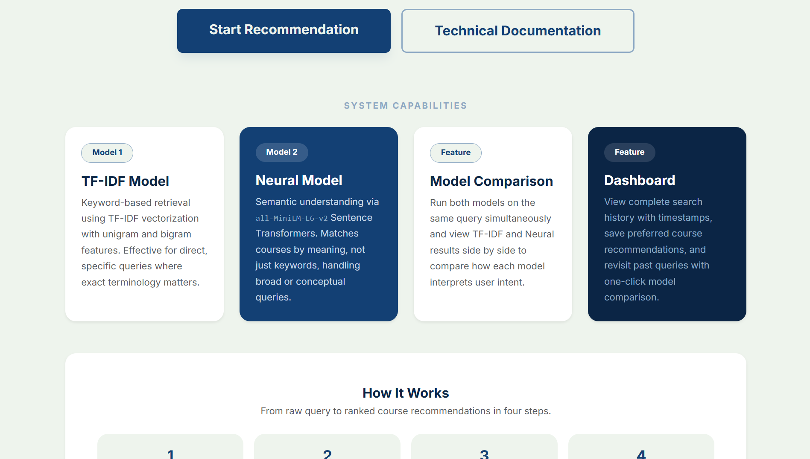
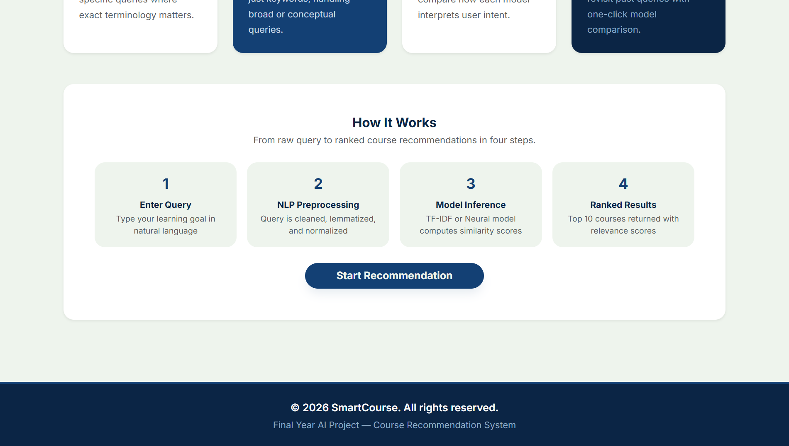
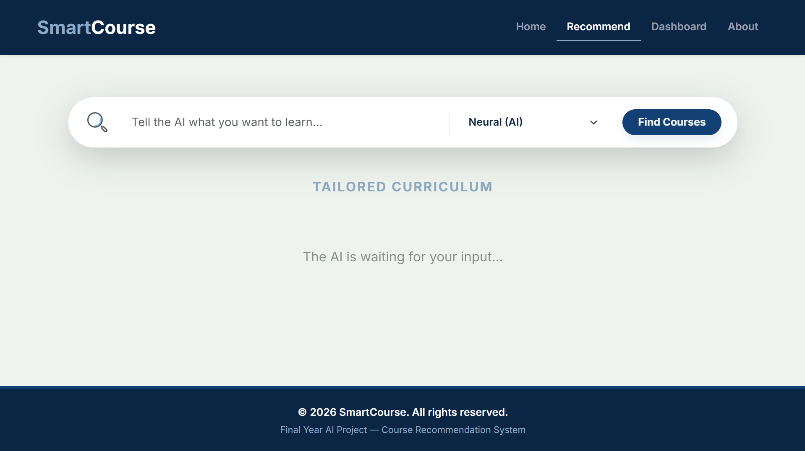
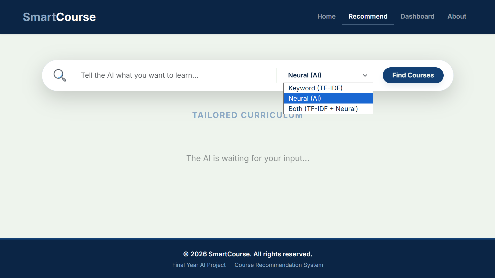
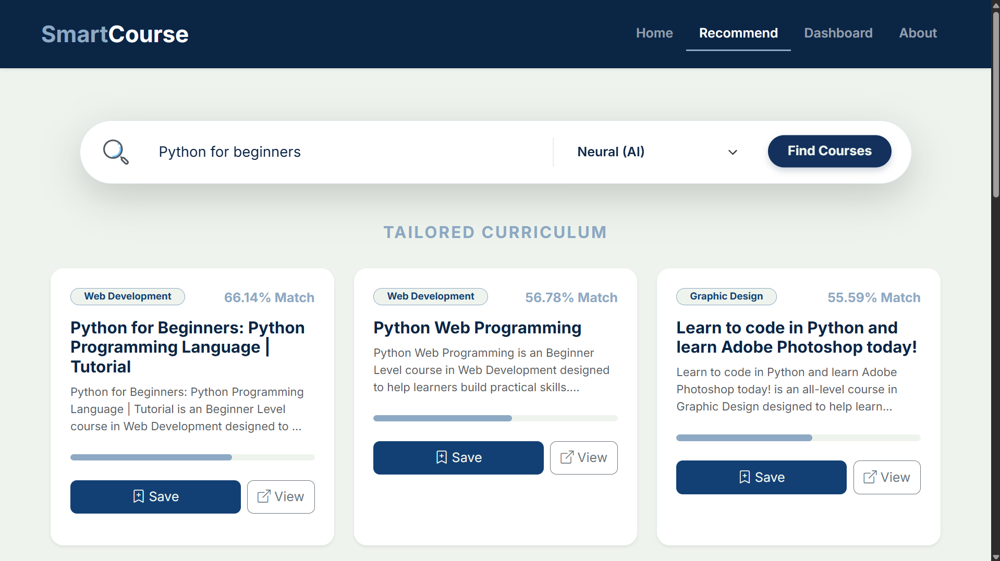
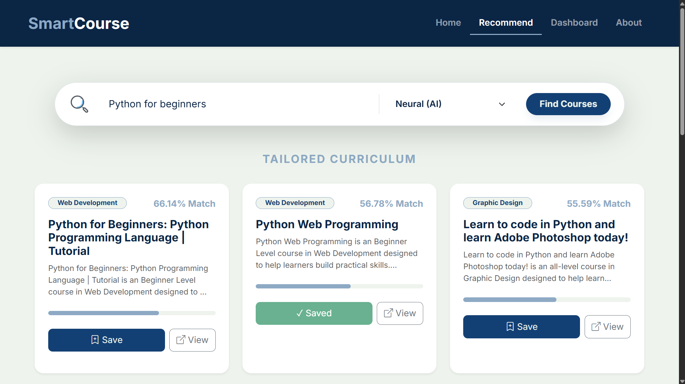
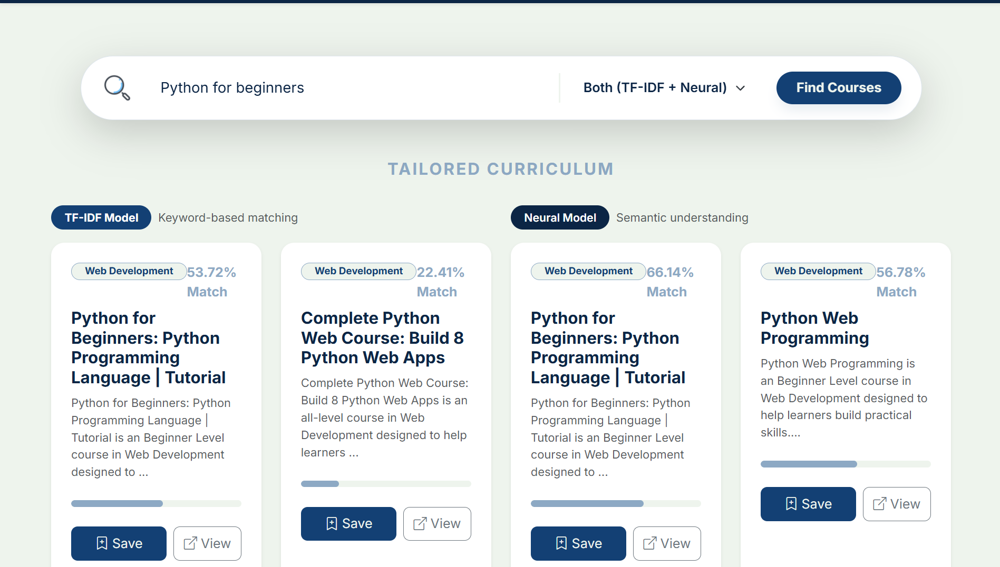
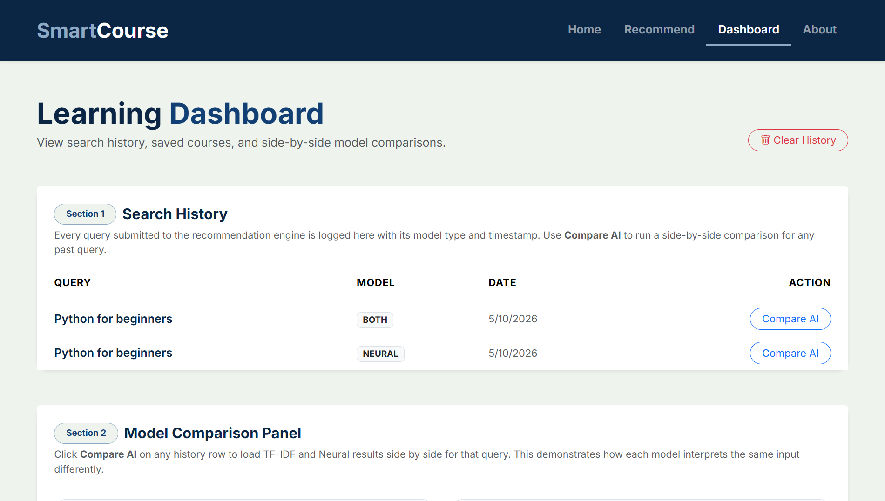
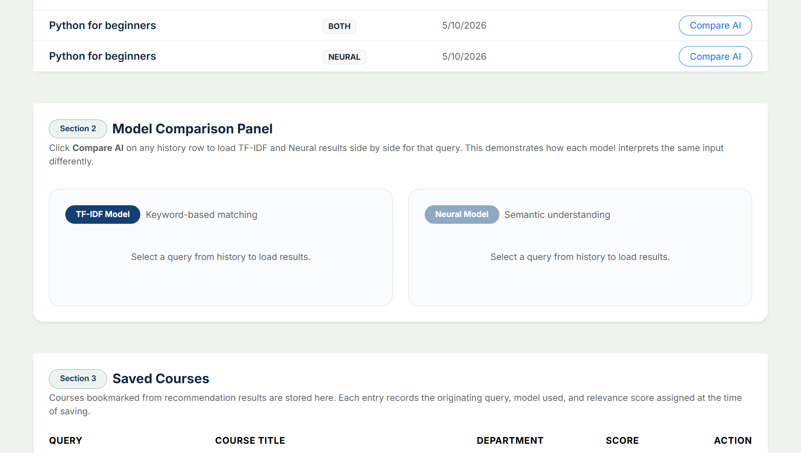
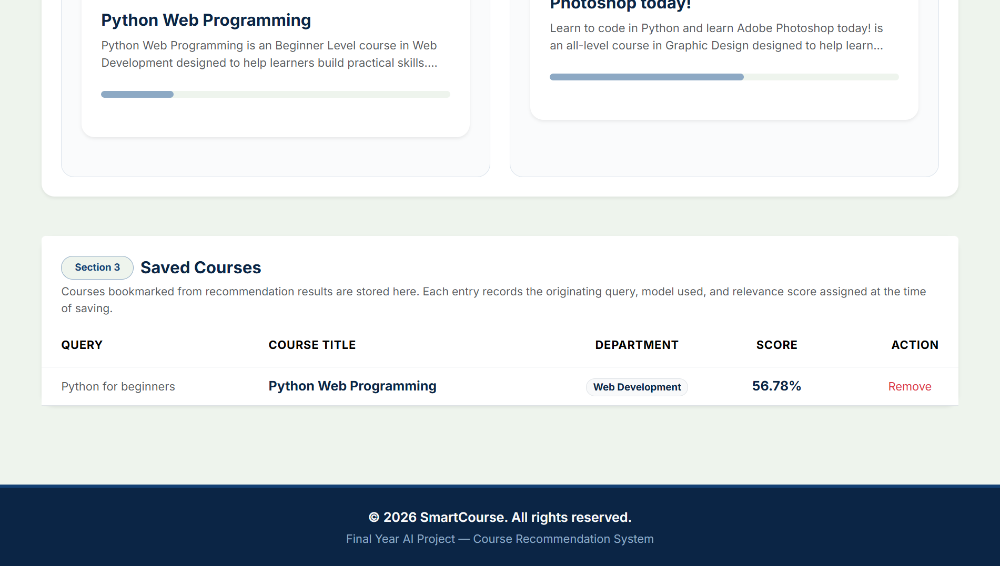

# SmartCourse — AI-Powered Course Recommendation System

> Final Year Project | BS Software Engineering | Virtual University of Pakistan

---

## Author

| Field | Details |
|---|---|
| Name | Hassan Asad |
| Roll Number | BC220417166 |
| Program | BS Software Engineering |
| University | Virtual University of Pakistan |

---

## Project Overview

SmartCourse is a full-stack AI-based course recommendation system that suggests relevant online courses based on natural language queries. It uses two different machine learning approaches — TF-IDF and Neural Embeddings — and allows users to compare their results side by side.

---

## Features

- Search courses using natural language queries
- Two recommendation models:
  - **TF-IDF** — keyword-based matching
  - **Neural** — semantic similarity using SentenceTransformer
- **Both Mode** — compare TF-IDF and Neural results side by side
- Save and manage favourite courses
- View search history with timestamps
- View Course button to open original course link
- Evaluation metrics: Precision@K, Recall@K, Hit Rate

---

## Tech Stack

| Layer | Technology |
|---|---|
| Backend | Flask (Python) |
| Frontend | HTML5, CSS3, JavaScript, Bootstrap 5 |
| ML / NLP | scikit-learn, sentence-transformers, spaCy |
| Database | SQLite |

---

## Machine Learning Models

### TF-IDF Model
- Uses Term Frequency-Inverse Document Frequency
- Captures keyword-based similarity
- Faster and interpretable
- ngram_range=(1,2) — unigrams and bigrams

### Neural Model
- Uses SentenceTransformer `all-MiniLM-L6-v2`
- Generates 384-dimensional semantic embeddings
- Captures meaning beyond keywords
- Includes query expansion for better coverage

---

## Evaluation Metrics

| Metric | Description |
|---|---|
| Precision@10 | How many of the top 10 results are relevant |
| Recall@10 | How much of the total relevant data is captured |
| Hit Rate@10 | Whether at least one relevant result appears in top 10 |

---

## Project Structure

    SmartCourse/
    │
    ├── app.py
    ├── config.py
    ├── train_models.py
    ├── requirements.txt
    │
    ├── utils/
    │   ├── preprocessing.py
    │   ├── tfidf_model.py
    │   ├── neural_model.py
    │   └── evaluation.py
    │
    ├── models/
    │   ├── tfidf_model.pkl
    │   └── neural_embeddings.pkl
    │
    ├── templates/
    │   ├── base.html
    │   ├── home.html
    │   ├── recommend.html
    │   ├── dashboard.html
    │   └── about.html
    │
    ├── static/
    │   ├── css/style.css
    │   └── js/main.js
    │
    └── data/
        └── Courses_dataset.csv


---

## Installation and Setup

**1. Create Virtual Environment**
```bash
python -m venv venv
```

**2. Activate Virtual Environment**
```bash
venv\Scripts\activate
```

**3. Install Dependencies**
```bash
pip install -r requirements.txt
```

**4. Install spaCy Model**
```bash
python -m spacy download en_core_web_sm
```

**5. Train Models**
```bash
python train_models.py
```

**6. Run Application**
```bash
python app.py
```

**7. Open in Browser**
http://127.0.0.1:5000


---

## How It Works

1. User enters a natural language query
2. Text is cleaned and preprocessed using spaCy
3. Query is passed to the selected model (TF-IDF, Neural, or Both)
4. Cosine similarity is computed against the course dataset
5. Top 10 results are returned based on highest similarity scores
6. Results are displayed as course cards with relevance scores

---

## Database

SQLite database (`database.db`) stores:
- **history** table — every search query with model type and timestamp
- **saved** table — courses bookmarked by the user with score and URL

---

## Important Notes

- Make sure the spaCy model is installed before running the app
- Run `train_models.py` once before starting the app to generate model files
- The application runs locally using the Flask development server

## Screenshots












